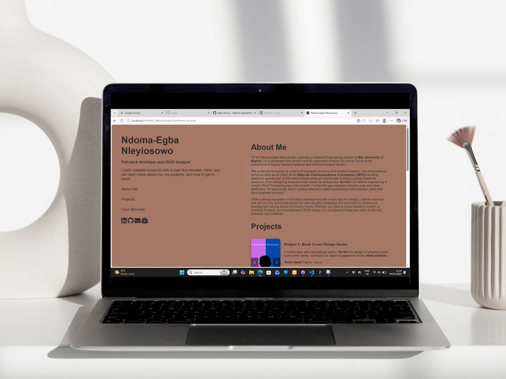

# 🚀 My Professional Portfolio
A responsive, high-performance portfolio website showcasing my work as a **Software Engineer & Graphic Designer**.

  

[Link to Live Site](https://ndoma-egba.github.io/Portfolio_Website/)

## 🎨 Design Philosophy
The goal was to create a simple earthy aesthetic that remains functional. I designed the custom icons in Figma to ensure they scale perfectly on mobile.

## 🛠️ Built With
- **Frontend:** HTML5, CSS3 (Flexbox & Grid),Java Script
- **Design:** Figma, FontAwesome
- **Deployment:** GitHub Pages

## 📱 Mobile Optimization
- Fully responsive layout using Media Queries.
- Touch-friendly navigation (min 44px tap targets).
- Sticky headers for improved section tracking.

## ⛰️ Key Challenges & Solutions
- "Making a sub-section- 90% width while maintaining a centered layout for Mobile view."
- "Had to use Max-width and not just width 😔"

## 📂 How to Run Locally
1. Clone the repo: `git clone https://github.com/yourusername/portfolio.git`
2. Open `index.html` in any browser.
